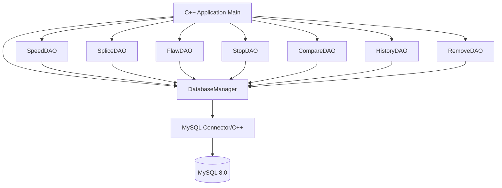
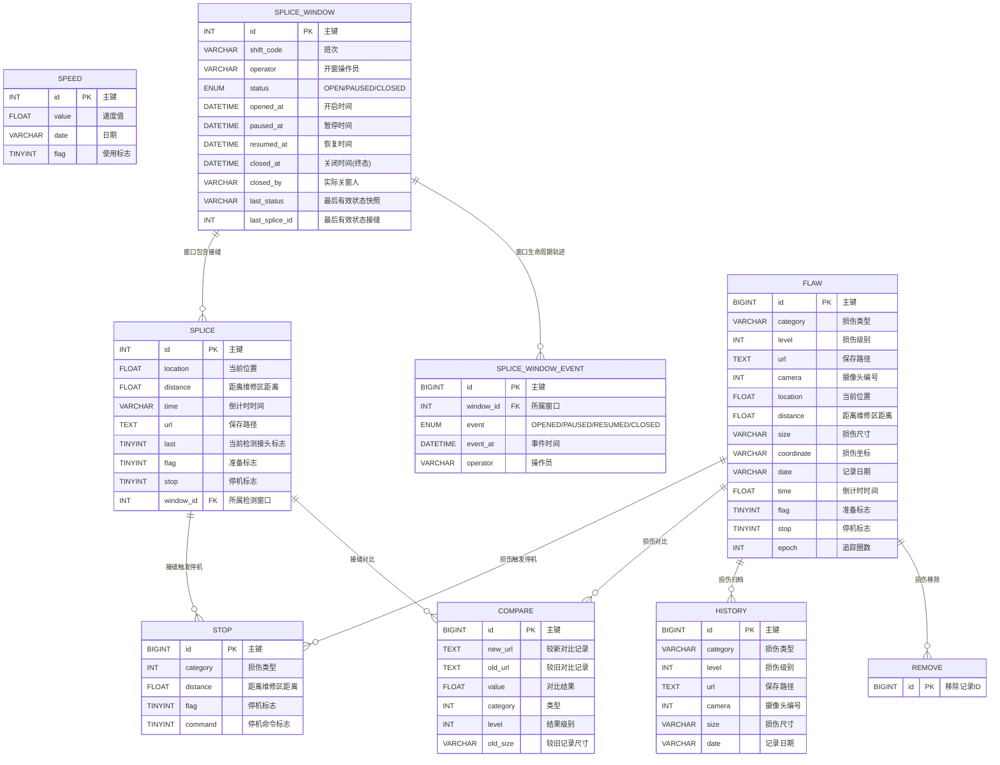

# 工业检测系统 - C++ MySQL 数据访问层

## 1. 系统架构



## 2. ER 图



## 3. 模块清单

| 模块 | 文件 | 职责 |
|------|------|------|
| DatabaseManager | db/DatabaseManager.h/.cpp | 连接池管理、SQL执行 |
| Entity | entity/*.h | 各表实体类定义 |
| DAO | dao/*.h/*.cpp | 各表CRUD操作 |
| Logger | utils/Logger.h/.cpp | 日志记录 |
| Main | main.cpp | 入口与演示 |

## 4. 技术选型

- C++17
- MySQL Connector/C++ 8.0 (X DevAPI / Legacy C API)
- CMake 3.16+
- spdlog (日志，可选，本项目使用自实现轻量Logger)

## 5. 接缝检测窗口生命周期

为解决跨班次时“上一班遗留接缝被误认成当前停机候选”的问题，SPLICE 记录不再靠零散标志位表达时效，而是归属于一个有明确状态与起止时间的**检测窗口**。

### 5.1 状态机

```
OPEN(开启/检测中) ──pause──> PAUSED(暂停)
PAUSED            ──resume─> OPEN
OPEN / PAUSED     ──close──> CLOSED(关闭，终态)
```

- 只有 **OPEN** 窗口接受 SPLICE 插入与 `last/flag/stop` 状态写入。
- PAUSED 窗口拒绝新数据；CLOSED 窗口拒绝一切写入和状态迁移。
- 约束由数据库触发器强制（`trg_splice_window_bu`、`trg_splice_bi`、`trg_splice_bu`），绕过 DAO 也无法写入。

### 5.2 查询范围

`findActive / findReadyToStop / findStoppable` 通过窗口状态过滤：只返回**所在窗口 OPEN** 的接缝，以及未纳入窗口管理的历史数据（`window_id IS NULL`，保持旧行为）。CLOSED 窗口记录不出现在当前查询，但仍可经 `findById / findAll / findByWindow` 复盘读取，既有读取接口签名不变。

### 5.3 关闭语义

- 关闭使用 `SELECT ... FOR UPDATE` 行锁事务：先关先得（`closed_by` 记录实际关窗人）。
- **幂等**：重复关闭返回首次关闭的同一 `closedBy/closedAt`，`closedNow=false`，不产生新事件或写入。
- 两名操作员用各自连接并发关窗时由行锁串行化，恰好一人成功。
- 窗口保存 `last_status/last_status_at/last_splice_id` 快照（由 AFTER 触发器维护），关闭后定格，供接班人复盘“窗口内最后一次有效状态”。

### 5.4 复盘轨迹

`SPLICE_WINDOW_EVENT` 记录 OPENED/PAUSED/RESUMED/CLOSED 全部事件、时间与操作人；状态迁移由触发器在同事务内追加，时间戳取迁移时刻（`paused_at/resumed_at/closed_at`）。

