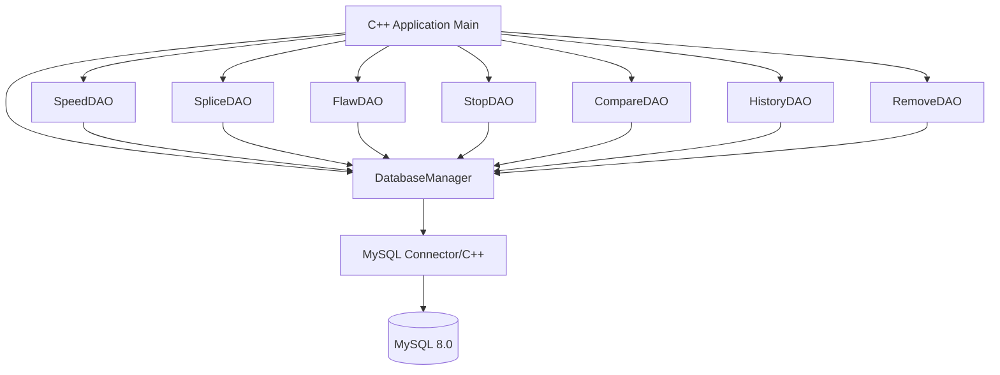
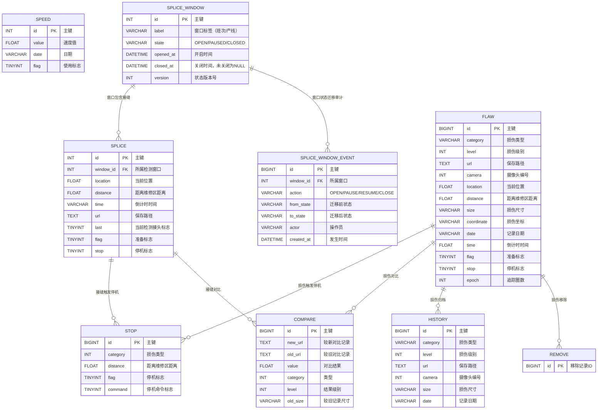

# 工业检测系统 - C++ MySQL 数据访问层

## 1. 系统架构



## 2. ER 图



### 检测窗口状态机

```
OPEN --pause--> PAUSED --resume--> OPEN
OPEN --close--> CLOSED（终态）
PAUSED --close--> CLOSED
```

- 同一时刻至多一个 OPEN 窗口（生成列唯一索引 `uq_window_open_singleton`）。
- 运行查询（当前接头/准备停机/可停机）只返回 OPEN 窗口的数据；`findById`/`findAll` 不过滤，保留最后有效状态供复盘。
- 写入（插入/标志更新）仅 OPEN 窗口可写；关闭后迟到的写入由 DAO 与触发器双层拒绝。
- 关闭幂等：重复/并发关闭返回同一 `closed_at` 与 `version`，审计表恰好一条 CLOSE。
- 全部迁移由触发器 `trg_window_state_guard` 校验，并落入 `SPLICE_WINDOW_EVENT` 审计表。

## 3. 模块清单

| 模块 | 文件 | 职责 |
|------|------|------|
| DatabaseManager | db/DatabaseManager.h/.cpp | 连接池管理、SQL执行 |
| Entity | entity/*.h | 各表实体类定义 |
| DAO | dao/*.h/*.cpp | 各表CRUD操作 |
| Logger | utils/Logger.h/.cpp | 日志记录 |
| Main | main.cpp | 入口与演示 |

## 4. 技术选型

- C++17
- MySQL Connector/C++ 8.0 (X DevAPI / Legacy C API)
- CMake 3.16+
- spdlog (日志，可选，本项目使用自实现轻量Logger)
